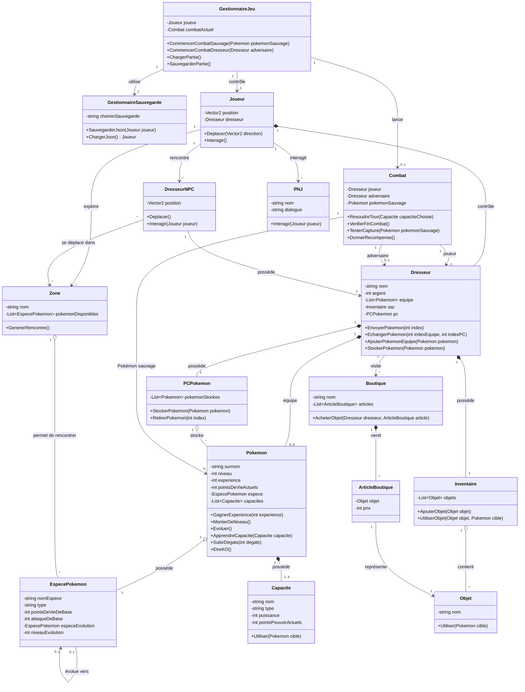

# Conception — diagramme de classe UML

Ce diagramme présente les principales classes et responsabilités du jeu RPG solo de style Pokémon/Game Boy. Il couvre notamment l'exploration, les combats, la capture, la gestion de l'équipe, le stockage dans le PC, la progression des Pokémon, les boutiques et la sauvegarde.

## Description des principales classes

### G
